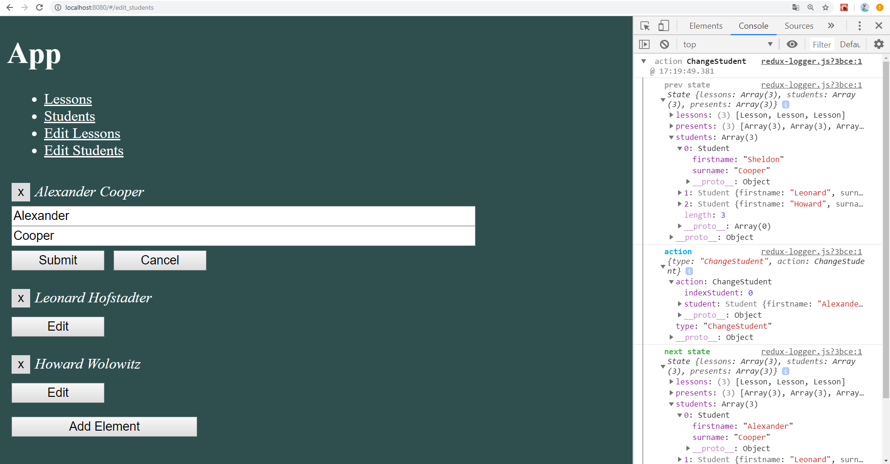

# KotlinJS 3.2
---
Middleware
-----------------------------------
### 1. Начальное состояние компонента App 

### 2. Состояние Store после добавления Lesson

### 3. Состояние Store после изменения Lesson

### 4. Состояние Store после удаления Lesson

### 5. Состояние Store после изменения Student

### 6. Состояние Store после добавления Student

### 7. Состояние Store после удаления Student
